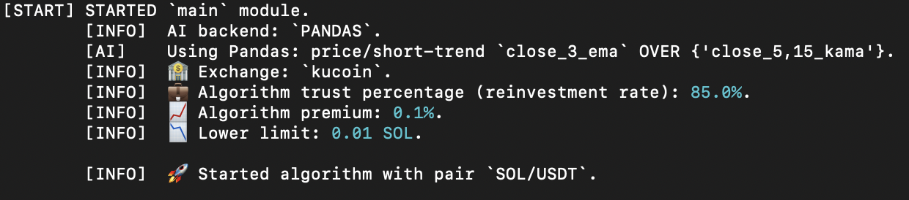
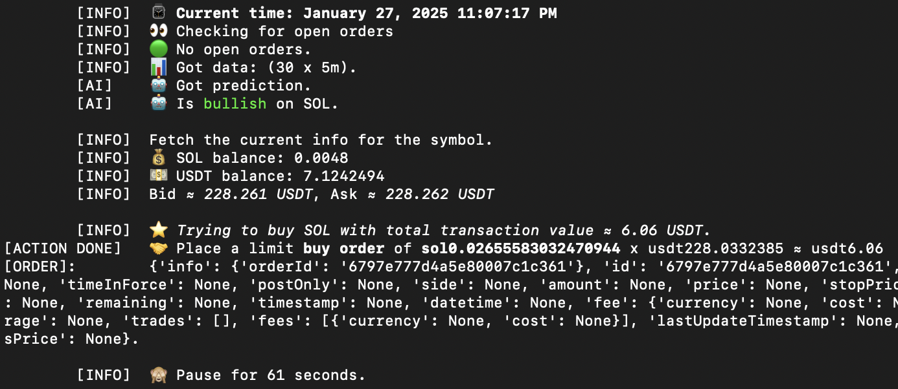
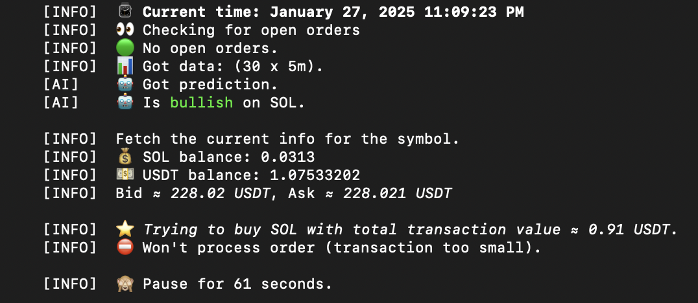
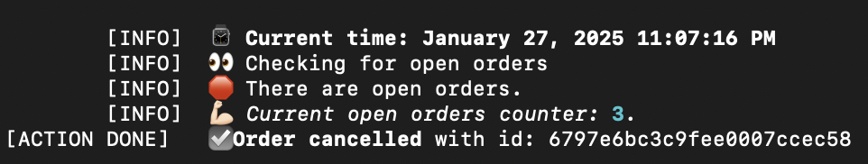
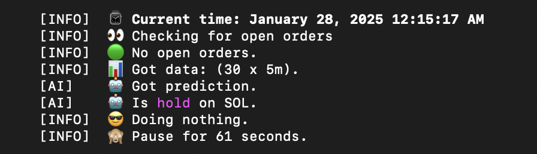

#### Disclaimer:

*Usage of this software in its current form will ***likely result in loss of funds***.*

*For all intents and purposes, this software is to be considered an educational example.*

*See [LICENSE](LICENSE) for more clarification. And do read this README carefully.*

# Crypto Autotrader

 © Stan

   
 
 

This is an architecture template repository. The software is capable of fully autonomous trading on popular cryptocurrency exchanges, once set up correctly.

Currently, it utilizes several naive approaches to spot trading (either [price-related crossovers](https://trendspider.com/learning-center/moving-average-crossover-strategies/) or
LLM-powered analytics is an option); however, it is highly customizable.

This software is open source under a permissive [License](LICENSE), and it's FREE.

There is a premium version of this software available via this Telegram **[link](https://t.me/premium_autotrader_bot)**.

*This is a Python 3.13 native project. Python 3.14 has been tested to work, as well. Support for older Python versions is not guaranteed, but deemed probable for 3.10 and newer (perhaps, after some dependencies downgrades).*

## Features

* Test mode to only test the prediction API – no trades would be made (absolutely suitable for LLM APIs; Pandas – debatable)

* LLM connection is through any 'openai' library supported API

* Operating under the assumption that one can only use one's own capital

* Default Python floating point real numbers (`float`) for prices & volumes

* Substantial error handling & designed to run indefinitely

* The trading bot script (function `main` of class `TradingBot`in module `trading_bot.py`) endlessly places buy and sell orders based on predictive modeling (with calculations of price and
  amount, see function `prepare_order` of class `TradingBot` in module [trading_bot.py](trading_bot.py)):

  a. Price for 'BUY' orders is `((bid + ask) / 2) x (1 - parametrized premium)`,

  b. Price for 'SELL' orders is `((bid + ask) / 2) x (1 + parametrized premium)`,

  c. Amount to buy is `parametrized reinvestment_rate x free quote token balance / price buy`

  d. Amount to sell is `parametrized reinvestment_rate x free base token balance`

## Environment Variables

To run this project, one would need to add the following environment variables to the `.env` file/-s (the currently
programmed logic is in two separate files for predictive and running modules, but it doesn't have to be).

All fields must be filled with valid strings. Fields that end with '_JSON' must be filled with valid json data strings.
`.env` files must be linked in the starting sequence (e.g., via command line arguments or as Default strings in the code).

### Main variables

*It is easier to create a new `main.env` as per [example](examples/main.env.example), that has included explanations for each
variable, as well*

`EXCHANGE_API_KEY` – API to access cryptoexchange

`EXCHANGE_SECRET` – API to access cryptoexchange

`EXCHANGE_PASSPHRASE` – API to access cryptoexchange

`ALGORITHM_TRUST_PERCENTAGE` – Reinvestment rate – how much of one's free balance (per token) is to be used for spot
orders (*default is 0.5, can be a real value in range [0.0;1.0]*)

`BASE_SLEEP_TIME` – sleep time in seconds between program cycles

`CANCEL_ORDER_LIMIT` – how many cycles to wait before cancelling all open orders (cancels orders on achieving CANCEL_ORDER_LIMIT)

`RETRIES_BEFORE_SLEEP_LIMIT` – how many times to retry without sleeping (only unknown errors)

`DATA_VECTOR_LENGTH` – Number of past-data points to use in predictive modeling

`DEFAULT_EXCHANGE_NAME` – 'CCXT' supported exchange name

`DEFAULT_EXCHANGE_FEE` – price fraction that is collected as order fee by crypto exchange (needed for calculations to support decision making)

`PREMIUM_OVER_EXCHANGE_FEES` – any positive real number (would be kept at 0.0, to only account for exchange fee without
additional premium/discount on bid/ask)

`MIN_TRANSACTION_VALUE_IN_BASE` – Minimal amount to spot-order base currency for a given trading pair

`TIMEFRAME` – Depending on cryptoexchange, this value can be set as either of: `1m`, `3m`, `5m`, `10m`, `15m`, `30m`,
`4h`, `8h`, `12h`, `1w`. See CCXT docs or exchange API for correct info on a particular exchange.

`TRADING_PAIR` – What to spot trade (e.g., `XMR/USDT`). NOTE: One must have both of these two tokens in any amount in
their portfolio present, before an order can be placed (If that isn't the case, the script will show a
`ProbablyAIButCouldBeAnything` exception with the ticker of the token one doesn't own).

`TRADING_BASE`, `TRADING_QUOTE` – if a trading pair doesn't have a `/` sign, these are necessary (i.e., if `TRADING_PAIR=XMRUSDT`, then `TRADING_BASE=XMR` and `TRADING_QUOTE=USDT` MUST be supplied)

### Predictions related variables

*(easier to create a new `llm.env` or `probability.env`, or `pandas.env` as per [example 1](examples/llm.env.example) or 
[example 2](examples/probability_llm.env.example), or [example 3](examples/pandas.env.example))*

`DEFAULT_PREDICTION_API` – either `LLM` or `PROBABILITY_LLM`, or `PANDAS` is supported

#### Case 1 — Pandas

If `DEFAULT_PREDICTION_API=PANDAS`, then:

`PREDICTION_OPERATIONAL_PRICE_TYPE` – stockstats.StockDataFrame supported indicator or price type (e.g., `middle_2_sma`
or `close`). Numbers cannot exceed `DATA_VECTOR_LENGTH`.

`PREDICTION_INDICATORS_JSON` – valid JSON array of stockstats.StockDataFrame supported indicators (e.g.,
`["close_5,15_kama","middle_15_ema"]`). Numbers cannot exceed `DATA_VECTOR_LENGTH`.

`PREDICTION_GLOBAL_SIGNAL_LAG` – integer value of 1 or greater (cannot exceed `DATA_VECTOR_LENGTH`).

#### Case 2 — LLM

If `DEFAULT_PREDICTION_API=LLM`, then:

`LLM_BASE_URL` – base URL for API of your chosen LLM,

`LLM_API_KEY` – your LLM api key,

`LLM_MODEL` – model name to use.

All three are further supplied to the 'openai' library calls.

Also, if `DEFAULT_PREDICTION_API=PROBABILITY_LLM`, then additional:

`LOWER_PROB` – Sell signal, if the probability of the prediction being correct is lower than (valid number or default 20)

`UPPER_PROB` – Buy signal, if the probability of the prediction being correct is higher than (valid number or default 80).

## Deployment

Running with a `-b` or `--base` flag will result in forwarding program output to a separately defined logic ([base_output.py](base_output.py) must be implemented).

#### 1

Create `.env` file/-s:

Parametrization of this software is achieved via the means of environment variables, specifically through the use of
`.env` **files**. So the files are essential.

#### 2

Link these `.env` files in [Python module run.py](run.py) either as command line arguments, or in the `if __name__ == "__main__":` section as
`DEFAULT_PREDICTION_ENVIRONMENT_FILENAME` and `DEFAULT_MAIN_ENVIRONMENT_FILENAME` constants. They don't *have* to be separate files, but
at least **a** filename must be supplied of a file containing the required Environment variables.
Not specifying a `<something>.env` file would result in scanning the literal file with the path '.env' in the same
directory as the script.

### Unix operating systems (GNU/Linux, macOS, ...)

#### 3

The required packages are installed with:

    pip install --upgrade pip && pip install -r requirements.txt

#### 4

Run from inside project directory:

Required:

Specify either `run` or `test` command to run the script in main mode or test mode, respectively.

Optional arguments: 
- `-p` or `--predictions` with a filepath – specify `.env` file with prediction API needed info
- `-e` or `--env` with a filepath – specify `.env` file with exchange API needed info
- `-b` or `--base` – specify this argument to run in [a different base output mode](base_output.py).

Example run

    python3 run.py run -e main.env -p probability_llm.env

With altered output
  
    python3 run.py run -e main.env -p probability_llm.env --base

Alternatively run from outside project directory (change `<path_to_`run.py`>` to actual path):

    sudo python3 <path_to_`run.py`> run -e main.env -p probability_llm.env

*One might be prompted to enter Administrator password*

***Run in test mode***:

    python3 run.py test -p probability_llm.env

***Run in test mode (outside project directory)***:

    sudo python3 <path_to_`run.py`> test -p probability_llm.env

### Windows

Untested.

### Docker

Untested.

## License

[MIT LICENSE](LICENSE)

## Authors

- Stan [@FunnyRabbitIsAHabbit](https://www.github.com/funnyrabbitisahabbit)

## 🚀 About the Author

I'm a Software Engineer, specializing in all things Python. I code a lot, I don't publish my code a lot. I happen to be a domain expert in Business, Economics & Finance, holding both M.Sc. & B.Sc. degrees in relevant
fields of study.

***I am also trying to fund my PhD with the current goal at USD 30,000. Most license payments and donations will go toward that. This includes move costs, visa applications and support, rent for while I study.***

I might be available for hire. Reach out with offers via email stevietfg+joboffer@gmail.com.

If you'd like to support me, in accordance with the nature and character of this
software, I prefer to directly accept donations in one truly CRYPTO currency – [Monero (XMR)](https://www.getmonero.org) at addresses:

* `83woV72JcSXiPfrddb25znWiPULtkwFmZVXdPGkvNj6DArk3LUxedsG71A7ErK5cRHBTJPpjSorEz6j5sCJs1C1gCjmagaL`

Monero is also the default crypto for this **Crypto Autotrader** to spot-trade.

If you wish to use any other cryptocurrency, use this external provider link (no KYC):

If you wish to use regular payment methods, use this donation link:

## Support

For support & troubleshooting, open issues or email us crypto.autotrader@outlook.com (with Subject: `[AUTOTRADER SUPPORT]`).

## Feedback & Ideas

For new ideas, open issues or email us at crypto.autotrader@outlook.com (with Subject:
`[AUTOTRADER IDEAS]`)

## Acknowledgements

This software is heavily reliant on the following masterpieces of programming:

* [ccxt library](https://github.com/ccxt/ccxt) with
  their [LICENSE](https://github.com/ccxt/ccxt/blob/master/LICENSE.txt) (to date: Feb 20, 2025)
* [Pandas library](https://pandas.pydata.org) with
  their [LICENSE](https://github.com/pandas-dev/pandas/blob/main/LICENSE) (to date: Jan 27, 2025)
* [NumPy library](https://numpy.org) with their [LICENSE](https://github.com/numpy/numpy/blob/main/LICENSE.txt) (to
  date: Jan 27, 2025)
* [stockstats library](https://github.com/jealous/stockstats) with
  their [LICENSE](https://github.com/jealous/stockstats/blob/master/LICENSE.txt) (to date: Jan 27, 2025)
* [openai library](https://github.com/openai/openai-python) with
  their [LICENSE](https://github.com/openai/openai-python/blob/main/LICENSE) (to date: Feb 6, 2025)

## Appendix

Currently, the usage of a lagged crossover is hardcoded as per the vision of the developer; however, altering that is very achievable:
updated can be the `predict_pandas` function in module `predict.py` – specifically, the way that lists `signals` and
`anti_signals` are filled. The part `{"_delta" * self.wait_for_n_signal_lags}` just needs to be eliminated, as do any
subsequent mentions of `self.wait_for_n_signal_lags`.

As is known, any trading system that utilizes Technical analysis techniques would be better off in markets with high
liquidity. With regard to this, it would be wise to pick trading pairs that are high in trading volume. However, other reasons can be considered; thus making the liquidity-related suggestion moot.

[This absolute unit of a Jupyter Notebook](examples/test_xmrusdt.ipynb) is my gift to the noob Technical analysis enthusiasts.
It can help them backtest their crossover strategies AND the code happens to be very compatible with this **Crypto
Autotrader**.

See my relevant affiliate links:

* [Rent a VPS/VDS worldwide, pay in crypto!](https://my.bluevps.com/aff.php?aff=684)
* [Crypto processing services for persons and businesses](https://account.nowpayments.io/create-account?link_id=3477503345)
* [Get 10% Cashback Rate on commissions on Kucoin](https://www.kucoin.com/r/rf/CX87WUV4) (or use referral code `CX87WUV4`)

## Screenshots

The software sends user-appealing info messages to the console.

### Console mode
   

   

   

   

   

